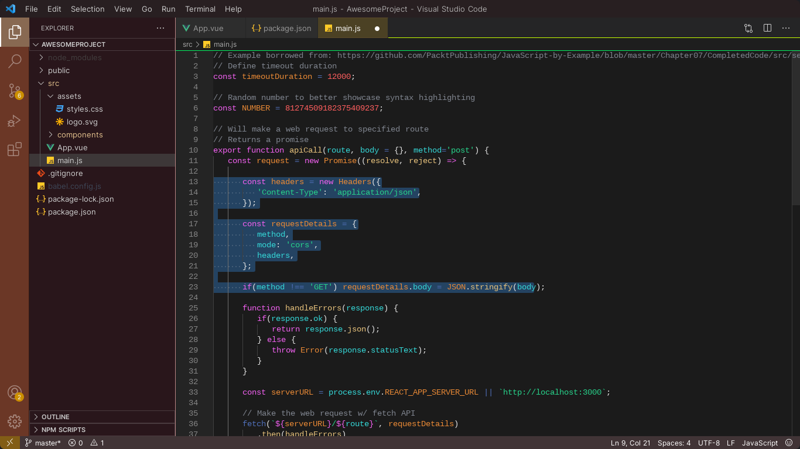

# Rusty Venture

This is a theme inspired by the colors of Mars and the Rust language. The UI mostly spans the spectrum from yellow, orange, brown, red, and magenta, with an array of vibrant colors used for syntax coloring. It was built using [Theme Studio](https://themes.vscode.one). For anyone who feels a certain color is out-of-place, edits are welcome! You can also make your own little clones by forking [my theme](https://themes.vscode.one/theme/tyfighter/Y3Xu4p8E) or build your own from scratch!

Source: https://github.com/tyanderson91/rusty-venture